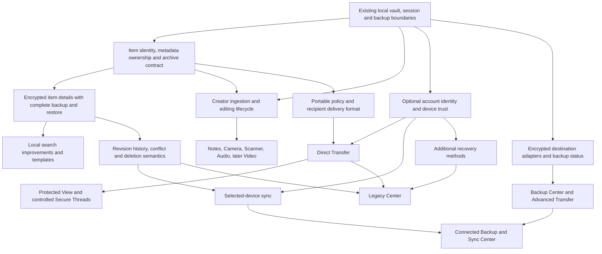

# KeyHollow dependency and compatibility plan

Prepared 2026-09-24 (America/Port-au-Prince). Status: **proposed engineering
sequence for review; no new product capability implemented by this change**.

## Decision in plain language

Build the next capability all the way through encrypted storage, backup,
restoration, locking, and its interface. Extend a shared foundation only when
that capability actually needs it. Keep account services separate from local
vault ownership.

The recommended next product milestone is **encrypted item details**: a
user-edited title and tags, searchable in the current folder and preserved in
backup/restore. Before coding it, settle its storage ownership, item identity,
and compatibility contract. This is a new engineering recommendation, not an
ordering stated by the user or by the addendum.

A rename-only release can reuse existing name fields and has a smaller scope,
but it does not establish the metadata/policy foundation. It is an optional
smaller alternative, not an architectural prerequisite. We should not ship two
competing title stores or implement a temporary tags format to get a quick UI.

The plan does not require accounts, sync, a complete policy engine, or every
future content type before local item details can ship. It also does not treat
a generic framework with no real consumer as a completed product milestone.

## Source, authority, and baseline

- Product source: [recovered Architecture Addendum](ARCHITECTURE_ADDENDUM_SOURCE.md),
  supplied by the user on 2026-09-07. Its section numbers are used below. The
  recovery preserves the recorded text; the original Word binary was not
  re-read on Ryzen. This plan adds analysis and sequencing, not new commitments.
- User direction: extend the existing app; map proposals before implementation;
  protect build quality; defer the two-iPhone test for now. The current request
  authorizes preparing this plan, not starting the proposed product stages.
- Audited code: protected `main` at
  `36b63e06fae92615fc5b24988ef123355f8b4bf0`, the Build 58 source.
  Main and accepted feature head share tree
  `9eb4a1e01c915a5d0d2d25c2ed4ea711b49598fe`.
- Delivery and test evidence: [PR #94](https://github.com/Frankbell84/KeyHollow/pull/94).
  Exact-main CI passed 437 unit tests, 3 UI tests, native build, and Swift
  CodeQL. User-reported acceptance covers current-folder imports and the
  guided one-iPhone encrypted backup/verify/restore scenario. Apple was
  verified Testing with Internal and Family after explicit user instruction.
- Limits of that evidence: two-device transfer, the full legacy/tamper/
  interruption/failure device matrix, and broader Family feedback remain
  outstanding. Same-phone success does not establish connected-service or
  cross-device readiness. Build 53 remains the recorded accepted rollback;
  downgrading it over future data is not established as safe.
- Existing [architecture boundaries](ARCHITECTURE_BOUNDARIES.md),
  [behavior baseline](RELEASE_BEHAVIOR_BASELINE.md), and
  [add-on release policy](ADDON_RELEASE_POLICY.md) remain applicable.
  Historical status paragraphs do not override later acceptance or authorization.

## Findings that determine the order

| Finding at the audited commit | Evidence | Consequence |
| --- | --- | --- |
| Photos and general files already have stable UUIDs and encrypted display names. There is no public rename operation in either store. | `Photos/VaultPhotoModels.swift`, `Photos/VaultPhotoStore.swift`, `AddOns/GeneralFileSupport/GeneralFileModels.swift`, `VaultGeneralFileStore.swift` under `KeyHollow/` | A rename is a transactional store mutation, not just a text field. Resolve title ownership before tags introduce another store. |
| Folder identity is `(photo or generalFile, UUID)`, independent of filenames. | `KeyHollow/AddOns/FolderPresentation/FolderPresentationModels.swift` | Preserve this distinction and all existing IDs. New native types need a compatible identity mapping; changing names must not move or recreate content. |
| Archive catalog roles are fixed; only one supplemental manifest is accepted. Catalog v4 adds a dedicated folder manifest, not a general module catalog. | `KeyHollow/Transfer/PortableArchivePayload.swift` | A separate metadata store needs an explicit archive extension. The old addendum recommendation for multi-module transport is only partially addressed by folder backup. |
| Restore rollback knows three data roots plus the new credential. | `KeyHollow/Transfer/PortableVaultRestoreTransactionJournal.swift`, `EncryptedVaultTransferCoordinator.swift` | Any additional persistent root must participate in the same validated transaction, including startup recovery and vault deletion. Adding only an export entry would be incomplete. |
| The unlocked session supplies revocable scoped cryptographic operations; add-ons need no raw vault key. | `KeyHollow/Session/VaultSession.swift` | Reuse this boundary for metadata and future creators. Lock/cancel must prevent stale writes, UI updates, and retained plaintext. |
| Search operates on supplied display text in the current location. | `KeyHollow/AddOns/CatalogSearch/VaultCatalogSearchQuery.swift`, `docs/VAULT_CATALOG_SEARCH.md` | Tags can feed sanitized display data through composition. Global search, OCR, and persistent indexes are separate changes with separate access rules. |
| Existing backup verification validates a whole-vault archive and discards staging. Restore reconstructs a vault containing its vault key. | `KeyHollow/Transfer/PortableArchiveSecurity.swift`, `EncryptedVaultTransferCoordinator.swift` | Keep backup/recovery distinct from recipient-restricted delivery. A full-vault backup must not be presented as a View Only transfer. |
| Current source contains local session/storage services, not account/device enrollment, remote delivery, or a sync conflict engine. | `KeyHollow/App`, `Session`, `Security`, `Transfer`; architecture checker | Connected services need their own designs and adapters. They must never become prerequisites for local unlock/import/export. |

Paths in the evidence column describe the audited source, not new modules.
Existing bounded video playback is not the future Workspace video recorder.

## Dependency map

The arrows indicate prerequisites, not a requirement to finish every branch
before continuing another. Boxes below describe proposed work unless marked existing.

Policy recipient binding needs device trust; basic local policy representation
can be developed before account services. A local backup status screen or SFTP
destination does not require sync, accounts, or Direct Transfer. Broader search
and creators need only their actual data/lifecycle prerequisites. Legacy also
needs a dedicated condition-verification and entitlement design; arrows do not
replace that review.

## Proposed stages and acceptance

No build numbers or dates are allocated by this plan. Each implementation stage
gets a focused branch/PR and proportionate tests; any feature release follows
the full release policy. A foundation PR must name its first real consumer and
may not silently grow into a rewrite.

| Stage | Deliverable and prerequisite | What closes it / user-visible result |
| --- | --- | --- |
| P0 — this plan | Recover the source, map current code, reconcile Build 58 evidence, record dependencies and undecided contracts. | Reviewable documentation; no binary or format change. |
| P1 — item-details contract | Decide one title owner, bounded tags, compatible typed identity, versioned archive handling and transactional mutation/restore. Use the decisions below. | Written schema/ownership/compatibility decision and concrete test cases. Resolve these before writing a new data format. This is the next engineering step. |
| P2a — first metadata module and transport | Implement the minimum P1 model and its encrypted store, application bridge, archive validation and complete restore/deletion handling together. Generalize transport only enough for this actual consumer; preserve existing decoders. | Native tests prove old archives still restore, new metadata survives, unsupported metadata is not silently lost, and failures preserve all existing vaults. No release claims from a storage-only implementation. |
| P2b — first item-details release | Connect title/tags editing, current-folder search and lifecycle cleanup to P2a. No account or sync dependency. | On one iPhone: edit a photo, video and file; search; move between folders; lock/reopen; export/verify/restore a separate vault; confirm details and original bytes. This is the first recommended new testable capability. |
| P3 — local extensions, individually selected | Metadata-backed search refinements/templates, or one Workspace creator. Use P2 where needed; first creator must prove a shared encrypted-ingestion boundary. Notes is the addendum's first creator; Camera/Scanner/Audio are separate milestones. | Each feature has a complete save, interruption, lock, delete and backup path. OCR/global search and video recording require their own feasibility/performance reviews. |
| P4 — history and data-state semantics | Add authenticated revisions, conflict preservation and explicitly defined soft-delete/grace behavior before sync or rich lifecycle automation. | Two divergent revisions survive; restore does not resurrect purged data unexpectedly; crash recovery is deterministic. Existing permanent-delete behavior changes only through an explicit product decision. |
| P5 — optional identity/device trust | Define account identity, device keys, enrollment, revocation, account recovery versus vault recovery, and service failure behavior. Can be designed alongside local stages. | A threat model and tested enrollment/revocation protocol; account/service loss does not block core offline vault use. No biometric/device PIN route to local vault unlock is introduced. |
| P6 — Direct Transfer, then Protected View | Combine P5 with a versioned recipient-delivery/policy contract distinct from whole-vault backups. Start with one minimal complete send/receive route. | Correct-recipient tests plus wrong/revoked device, replay, interruption and unsupported-policy tests. Real two-device acceptance is required. Add View Only/time/watermark policies one at a time with tested enforcement at every app export/view path. |
| P7 — destinations and backup status | Start from the existing encrypted archive engine with one secure destination adapter and accurate status. SFTP first, WebDAV next; S3/custom HTTPS later per the source. This branch need not wait for P5/P6. | Interrupted/retried transfers preserve source and last valid backup; certificate/host identity failures stop safely; status distinguishes uploaded from verified/restorable. Secure credentials stay in a platform adapter. |
| P8 — selected-device sync and connected center | P4 plus P5 and a reviewed encrypted sync transport. Reuse backup/status components where appropriate without treating backup as sync. | Offline edits, conflicting updates/deletes, revoked devices and interrupted sync preserve user data. Two-device acceptance and deletion-policy review are mandatory. |
| P9 — recovery, Legacy, Secure Threads | Additional recovery methods depend on a reviewed wrapping/authorization design; trusted-contact methods need identity. Legacy then adds verified conditions, recipients and entitlement rules. Threads follows authenticated delivery, participant rules and retention. These are separate modules/releases, not one combined stage. | Failure/abuse scenarios validated separately. Billing lapse never triggers Legacy; no hidden plaintext recovery. Threads stays content-bound and enforces attachment policy. |
| P10 — richer automation and intelligence | Build on stable metadata/history and explicit privacy choices. Use only the capabilities actually available. | Previewable, bounded actions; permission and locked-state checks; no hidden network disclosure or destructive automatic conflict resolution. |

P4–P10 specify dependencies and useful groupings, not a commitment to implement
them in numeric order. P1–P2 are the recommended immediate sequence. Optional
local features can be selected independently once their prerequisites hold.

## P1 decisions that must precede implementation

1. **Title ownership.** Existing photo/general-file `displayName` values already
   travel in their encrypted manifests. Decide whether user titles mutate
   those fields or are explicit metadata overrides with a documented fallback.
   Prefer existing ownership for a rename-only feature. If overrides serve the
   broader metadata design, define gallery/search/export precedence and exactly
   one write path; never maintain two writable copies of the same title.
2. **Identity.** Preserve existing item UUIDs and source type. Choose a bounded,
   versioned namespace mapping for any new module. Do not re-key or rewrite
   blobs merely to rename an item. Map references to the fresh destination
   vault on restore, and define duplicate-item identity separately from moving.
3. **Metadata limits and privacy.** Define title/tag lengths, Unicode and empty
   values, duplicate tags, item/manifest limits and per-vault scope. Keep tags,
   descriptions and policies in authenticated encrypted data. Separate editable
   descriptive metadata from security-enforced policy and integrity assertions.
4. **Portable module contract.** Compare a narrowly versioned extension against
   a bounded namespaced catalog using metadata as the first consumer. Recommend
   an explicit module inventory rather than repeatedly adding unowned sidecars;
   do not allocate a catalog version until the schema is reviewed. Define
   required versus optional modules, canonical names, limits, authentication,
   duplicate rejection and required module availability before installation.
5. **Mutation and recovery.** Decide whether an operation spans stores. A title
   plus tags edit must be one atomic operation or have explicit partial-result
   semantics. Integrate every new root into restore, startup recovery, source
   deletion/vault deletion and cleanup; recover only transaction-owned paths.
6. **Old-client behavior.** New clients must read historical archives. Old
   clients may reject newer archives; they must not be described as fully
   compatible unless tested. Never silently strip user metadata or access
   restrictions to produce a legacy export. Define unsupported-module errors
   and safe preservation/rejection before approving any downgrade feature.
7. **Editor surface.** Existing general-file documentation defers editing to a
   post-import settings surface. Choose a discoverable item action/details view
   or retain that location deliberately; update that documented contract if it
   changes. Keep import direct and unchanged.

## Proposal-to-code mapping

E = existing-module enhancement; N = new optional module; F = future provision.
Risk describes change impact: M = bounded local data/UI change; H = storage,
security, protocol or service design with significant failure consequences.
Proposed owner names are responsibilities, not assertions that those modules
already exist. Source references point to the recovered addendum sections.

| Source proposal | Current capability / affected owner | Proposed additive change | Dependencies / risk / stage |
| --- | --- | --- | --- |
| §3 Create/encrypt, authorized view, import, export/save | PhotoCore, GeneralFileSupport, Session, preview/video, Transfer; working local flows | E: retain these boundaries for new content; extend ingestion through composition | Per-content lifecycle and format tests; H for new persistence; P2/P3 |
| §3 Move / duplicate | FolderPresentation moves typed references; duplication is not established by this audit | E: preserve move; define independent copy identity, metadata/policy inheritance and failure cleanup for duplicate | Identity and ownership contract; M/H; P3 separately |
| §3 Editable metadata; tags/categories | Encrypted display names exist; no general user metadata editor/tag module | N/E: metadata owner, scoped editing API and narrow UI adapter | P1 and complete portable support; H; P2 |
| §3/§11 Names/metadata search | CatalogSearch supplies current-location text matching/sorting | E: compose sanitized metadata into matching; bound input and clear state on lock | P2 metadata; M; P2b/P3 |
| §11 Notes/text/OCR/global search and result modes | No full-text/OCR/global index in current search | N: optional encrypted/rebuildable index and OCR adapter, elevated authentication for global scope, Standard/Private results | Content access contract, scoped index lifetime, platform feasibility; H; P3 separately |
| §3/§10 Backup/restore, archive | Transfer plus BackupVerification and folder bridge | E: include each new module; define archive retention separately from backup and sync | Versioned catalog and complete transaction; H; P2/P7 |
| §3/§10 Trusted-device selective sync | Local vault ownership; no sync engine found | N: encrypted changes with device scope and conflict-preserving application | P4 history + P5 trust + reviewed transport; H; P8 |
| §3/§10 Versions and conflicts | Atomic local store updates/restore journal; no user version-history system | N: revision identity, causal/change history and preserve-both resolution | Metadata/identity and deletion semantics; H; P4 |
| §3/§10 Soft delete / grace recovery | Current deletion is permanent behavior | N: opt-in recovery/history layer with explicit purge and backup rules | Explicit product change, retention and quota design; H; P4 |
| §4 Programmable policy | Authenticated storage exists; no portable access-policy engine | N: versioned policy separate from editable metadata, interpreted by compatible clients | Identity/binding where needed, capability negotiation, threat model; H; P6 contract |
| §4 Dates, duration, location, export/transfer restrictions | No policy enforcement for these proposals | N/F: individually scoped rules covering every applicable read/export route | Clock/offline/revocation/location semantics and platform review before claims; H; P6 incremental |
| §5 Protected View / forensic watermark | Secure preview, lock cleanup and video rendering exist | N: policy-controlled viewing, recipient/session watermark and supported capture-state response | P5/P6, UI/export enforcement and accessible rendering; H; after basic P6 |
| §5 Private Environment Required | No such detection feature | F: optional experimental risk signals only | Feasibility/privacy review; cannot establish absence of a camera; H; deferred |
| §6 Direct Transfer | Whole-vault encrypted file export/import exists; no account delivery service | N: simple recipient pairing, authenticated delivery and policy-preserving receipt | P5 plus recipient envelope/policy contract; H; P6 |
| §7 Advanced Transfer / Secure Destinations | No remote destination adapters | N: saved SFTP destination, then WebDAV; S3/custom HTTPS follow later | Encrypted-package boundary, secure credential adapter, retry/overwrite design; H; P7 |
| §8 Hollow Notes | General files can store text; no native note creator/editor | N: note model/editor using shared encrypted ingestion; define revisions and backup | P1 identity/ownership; P4 when history/conflicts exposed; M/H; P3 first creator |
| §8 Hollow Camera | Photos import adapter exists; no direct capture route established | N: camera adapter feeds encrypted ingestion without default camera-roll save | Permission, temporary-data, cancellation/background tests; H; P3 |
| §8 Hollow Scanner | Image ingestion/preview available | N: scanning adapter on camera pipeline, document representation and optional OCR | Camera ingestion; document validation and supported API review; H; P3 after camera seam |
| §8 Hollow Audio | General-file storage available; no recorder | N: bounded recording with protected staging and interruption handling | Shared ingestion, audio permissions/lifecycle; H; P3 separate |
| §8 Hollow Video | Existing bounded video import/playback; no secure capture/streaming recorder | F: recording and later streaming/storage design | Measured storage/memory limits, interrupted recording and backup design; H; later P3 |
| §8 Browser/email; §14 standalone messenger | No corresponding implementation | F: long-range possibilities, explicitly outside first Workspace wave | Separate product/architecture decision; H; unsequenced |
| §9 Identity, privacy modes, trusted devices, disclosure | Local LowKey/device-bound credential ownership | N: optional service identity, device enrollment/revocation, minimum disclosure; enterprise mode remains future | Threat model; account access must not imply local vault decryption; H; P5 |
| §10 Backup & Sync Center | Read-only single-archive verification summary | N: destinations, device scope, truthful status/history and recovery information | Local backup center may precede P5; connected sync waits for P8; M/H; P7/P8 |
| §12 Recovery key / encrypted package / trusted contact | Archive recovery code exists and cannot unlock the local keypad | N/E: optional user-controlled recovery wrappers and recovery UX | Separate archive, account and vault recovery; trusted-contact identity; H; P9 |
| §13 Legacy Center | No legacy service | N: per-item/folder recipients/access, verification/check-ins, versioned wishes independent of billing | Trust, recovery, policy, delivery and verified conditions; H; P9 |
| §14 Send Only / Request Response / Secure Thread | No messaging service | N: restrictive content-bound communication, allowed participants/replies, retention, governed attachments, optional activity signals/notifications | P5/P6 plus separate retention/abuse design; H; P9 |
| §15 Templates | Folder organization exists | N/E: metadata-backed defaults for records/collections | Stable metadata schema, bounded creation and rollback; M; P3 |
| §15 Timelines / relationships | Folder membership exists; no general relationship or event history | N: typed relationships and user-visible authenticated events | Identity, referential integrity and P4 history for timelines; M/H; P3/P4 |
| §15 Automation / reminders | No rule scheduler in the vault feature set | F: explicit user rules using existing authorized operations | Stable metadata/history, lock behavior and background execution feasibility; H; P10 |
| §11/§15 Semantic search / intelligent categorization | No intelligence service/index found | F: optional local/privacy-reviewed assistance | Consent/data-flow design, resource bounds, access-scoped retrieval; H; P10 |
| §16 Integrity/seals / minimal audit history | Authenticated encryption detects tampering; no user sealing/history feature | N: explicit sealed revision and limited encrypted audit records | Revision identity; distinguish integrity from truth and signer authenticity; H; P4/P6 |
| §16 Recipient-bound tier / policy profiles | No service policy tiers | N/F: explicit tested capabilities behind simple profiles | P5/P6; profile labels must match actual enforcement; H; after P6 |
| §19 `.lowkey` naming | Current files use `.khvault` | Product decision only; no rename in this plan | File association, interoperability and migration review if later requested |

Plain FTP is excluded by the addendum. FTPS/SMB require demonstrated demand and
a separate review; this plan does not add them to the committed build queue.

Separately requested deferred ideas in the original task remain separate from
this addendum: Break-in Reports / Intruder Capture; App Icon Camouflage; Vault
Escape Hatch through a Share Extension and competitor migration guidance.
They require their own scope/feasibility reviews. Failed-attempt logs must not
reveal hidden vault existence; capture permissions/behavior are undecided;
camouflage requires platform/product review; Share Extension import must use
explicitly shared files and the same protected ingestion lifecycle. None is
silently promoted ahead of the dependency plan.

## Compatibility and regression contract

| Boundary | Required evidence before a feature ships |
| --- | --- |
| Existing local vaults | Open unmodified historical fixtures; read before any optional migration; never require accounts or new credentials to keep existing local access. |
| Archive versions | New reader restores v1–v4 fixtures, including root-only v3 and folder-aware v4. New format tests cover required/unknown/duplicate modules, canonical names, bounds, tampering and truncation. No implicit fallback that drops metadata or policy. |
| Unknown newer local data | Define refusal or preservation before write. An older decoder ignoring unknown fields is not proof that older writers preserve them. Test load-modify-save, not just load. |
| Atomic changes | Inject write/cancel/crash failures; previous durable data survives or the documented transaction recovers. Restore publishes the credential only after all required data is installed. No collateral deletion. |
| Item identity | Same UUID in distinct content kinds remains distinct; rename/move retains identity and bytes; duplicate and restore mappings are deliberate and tested. |
| Lock/background | Stale operations cannot write to another session or reveal another vault. UI/editor/index/player cleanup and protected temporary-file removal complete through the existing lifecycle boundary. |
| Limits and resources | Retain current count/size/path bounds unless separately reviewed. Benchmark metadata growth, large catalogs and memory; reject oversized input before expensive reads/hashing. |
| Add-on removal | Core can still open supported old vaults. Data requiring an unavailable add-on must be preserved or rejected with a clear unsupported-capability result, never silently discarded. |
| Rollback | Preserve original vaults and known-good archives. Do not reinstall an old app over newer writable data as an assumed rollback. State which versions can read AND safely mutate each format. |
| Security policy | Descriptive tags cannot grant access. View Only cannot be bypassed by share, save, duplicate, backup, creator, preview or transfer paths. Owner recovery copies and recipient delivery copies require distinct threat models. |

Use the existing archive/container/security, folder bridge, transfer coordinator,
lifecycle, media and catalog test suites as regression anchors. Add tests at
the owning boundary for each new behavior; avoid replacing production behavior
with test-only implementations. Test fixtures must be disposable, with no
signing material, real vault data, tokens, or N150 caches.

The two-phone check can remain deferred during local planning and development.
It must be completed before claiming cross-device compatibility, accepting
Direct Transfer, or accepting sync. Any new format gets its own same-device
round trip; Build 58 acceptance does not automatically cover it. Unsupported
policy and adversarial/failure tests remain separate from a successful round trip.

## Delivery, ownership, and status maintenance

- One focused branch/PR per reviewed stage; no force-push or shared-history rewrite.
- Preserve cryptographic algorithms, current key derivation, credential behavior,
  and existing media UX unless the selected feature requires an explicitly
  reviewed change. Never merge the historical cloud branch wholesale.
- Keep proposed module names, unimplemented concepts, automated evidence and
  user-reported acceptance visibly distinct in documentation.
- Required code gates remain architecture/workflow/privacy/release checks,
  native regression tests and Swift CodeQL, then the protected-main/signing/
  TestFlight/device sequence under the release policy and current user authority.
- A documentation commit creates a new source SHA; it does not change the
  installed Build 58 binary or inherit that binary's exact-SHA release evidence.
  No new build, signing run, upload, merge or distribution expansion is part of P0.
- Keep `WORK_STATUS.md` as the current resume point and this plan as the current
  proposed dependency sequence. Add later product changes with provenance;
  never convert exclusions or assistant suggestions into user commitments.
- Historical docs contain stale candidate statements. The README/work-status
  checkpoint and folder-backup statement are reconciled in this stage. The old
  PR-template TestFlight-before-final-merge checklist also conflicts with the
  newer protected-main-first release policy; correct that template in a separate
  release-process documentation review before the next product PR uses it.

## Immediate handoff

P0 produces this source-grounded plan and its review. **P1 is next:** decide the
item-details ownership/identity/archive contract and write its acceptance cases.
Only then start P2 implementation. If the user chooses another capability,
follow that capability's mapped prerequisites instead; this recommendation does
not authorize a new feature, connected service, format migration, or release.
